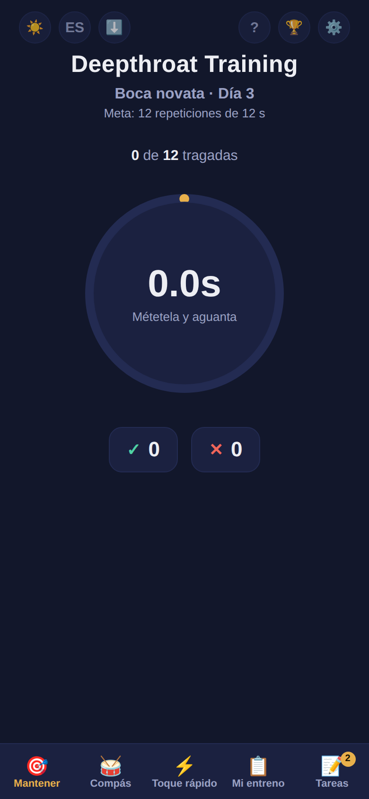
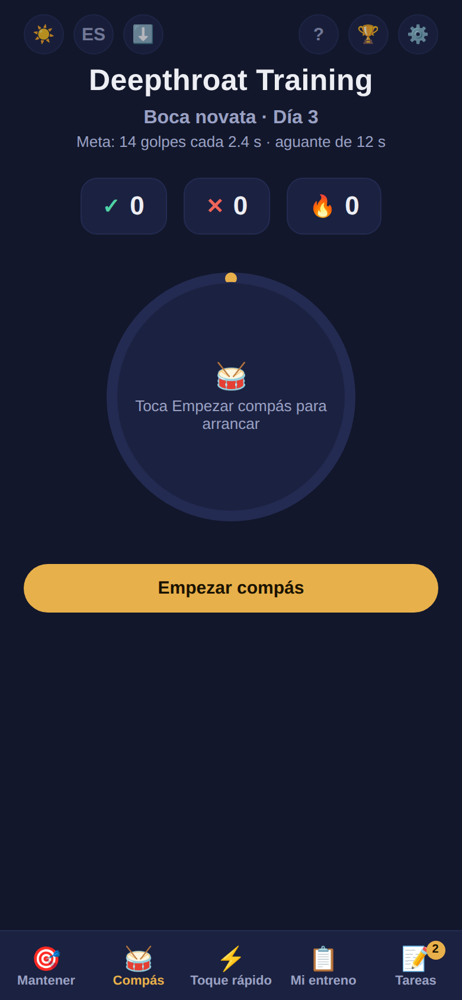
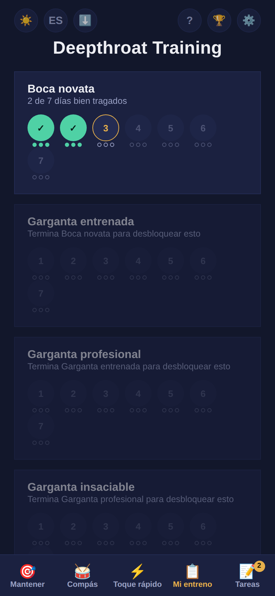
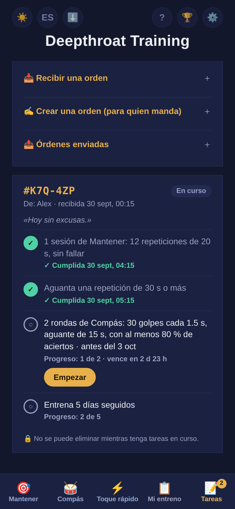

  

<h1 align="center">Rutina</h1>

  Una app de entrenamiento gratuita y privada para adultos que practican deepthroat. 
  Sin cuentas, sin rastreo y sin tienda de apps. Funciona sin internet.

  <a href="https://santi-kinky-apps.github.io/DT-training/"><b>▶ Abrir la app</b></a> ·
  <a href="README.md">Read in English</a>

> **Solo +18.** Este proyecto es exclusivamente para adultos que consienten.

---

## Qué es

Rutina es un temporizador de entrenamiento que se usa con las manos libres: apoyas el celular sobre el juguete y tocas el botón grande con la nariz. Te guía por un programa de 4 niveles y 28 días, lleva tu progreso y tu racha, y permite que otra persona te mande tareas.

  
  
  
  

## Funciones

- **Tres pruebas por día**
  - **Mantener:** aguanta el botón el tiempo de la meta.
  - **Compás:** toca en cada golpe y aguanta cuando suena la alarma.
  - **Toque rápido:** toca lo más rápido que puedas hasta que se acabe el tiempo.
- **4 niveles × 7 días** que se desbloquean en orden. Después viene **Hardcore**, con su propio progreso, y luego el **Modo Maestro**.
- **Modificadores:** Entrenamiento perfecto (un fallo reinicia el conteo), Entrenamiento continuo (tiempo límite entre repeticiones), Modo seguro (ningún aguante pasa de 20 s) y Ritmo real (un día por día de calendario).
- **Editor de segundos** para hacer cada nivel más fácil o más difícil.
- **Tareas:** alguien crea una orden, tú pegas el código y la app tacha las tareas sola mientras entrenas. Cada orden tiene un identificador único, así que un pantallazo sirve de prueba.
  - Tareas diarias, tareas sorpresa y cuenta regresiva de los plazos.
  - Castigo automático si algo vence.
  - Opcionalmente, la orden puede bloquear tus ajustes hasta que termine.
- **Logros**, calendario de entrenamiento y racha.
- **Código de respaldo** para pasar tu progreso a otro celular o navegador.
- Español e inglés, tema claro y oscuro, tres paletas de colores.

## Instalarla en el celular

Abre el enlace en el navegador del celular. Si te llegó por Telegram, WhatsApp o Instagram, primero toca ⋯ → *Abrir en el navegador*.

**iPhone (Safari)**
1. Toca **Compartir** (el cuadrito con la flecha).
2. Toca **Agregar a inicio** y luego **Agregar**.

**Android (Chrome)**
1. Toca el menú **⋮**.
2. Toca **Instalar app** o **Agregar a la pantalla principal**.

Se abre a pantalla completa como una app normal, aparece como **Rutina** con un ícono neutro y, después de la primera vez, funciona sin internet.

## Privacidad

- La app **no recoge, no envía y no guarda datos en ningún servidor**. No hay servidor.
- Todo (progreso, ajustes, tareas) se guarda **solo en tu celular**, en el almacenamiento del navegador.
- No hay cuentas, analíticas, publicidad ni cookies.
- Los códigos (respaldo, tareas) son solo texto que tú mismo copias y pegas.

Como todo es local, si desinstalas la app o borras los datos del navegador, pierdes tu progreso. Antes, haz un código de respaldo en ⚙️ → *Copia de seguridad*.

## Aviso

Esta app es solo una herramienta de conteo y temporización, sin relación con ningún organismo médico o de salud. Los niveles, tiempos y repeticiones son valores de juego, no una recomendación médica ni fisiológica. Escucha a tu cuerpo y detente si algo duele. Su uso es responsabilidad exclusiva de quien la usa; quien la creó no se hace responsable por lesiones, daños o cualquier consecuencia derivada de su uso.

## Comentarios

¿Encontraste un error o tienes una idea? [Abre un issue](../../issues/new/choose). Si es un error, indica tu modelo de celular y tu navegador.

## Apoyo

Si la app te sirve, puedes [invitarme un café ☕](https://buymeacoffee.com/santikinkyapps).

## Licencia

Hecha por Santiago. Bajo licencia [CC BY-NC 4.0](LICENSE): puedes compartirla y adaptarla dando crédito, **pero no con fines comerciales**.
