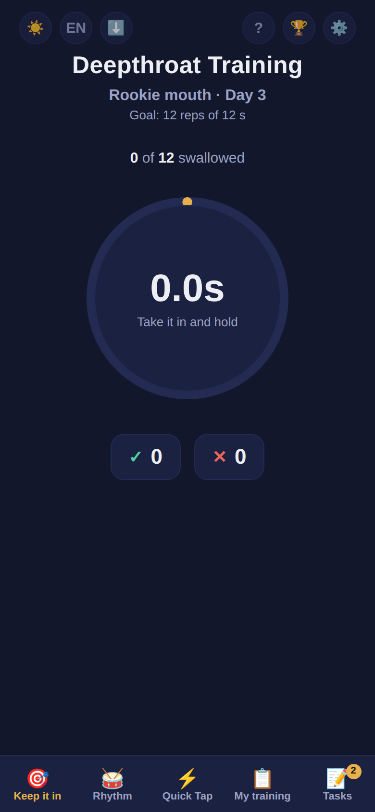
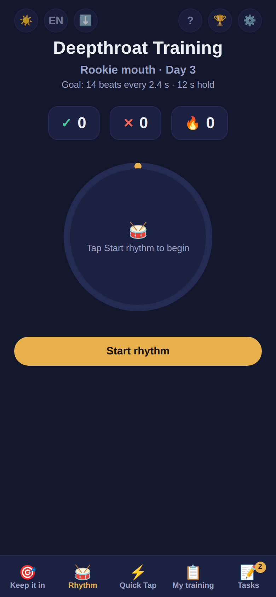
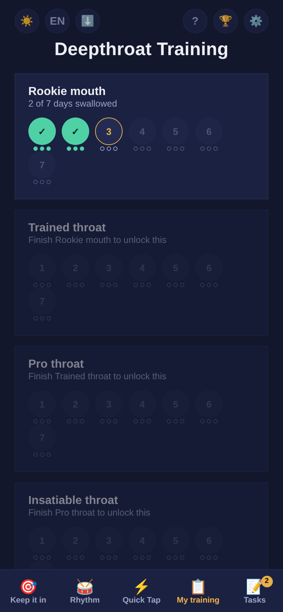
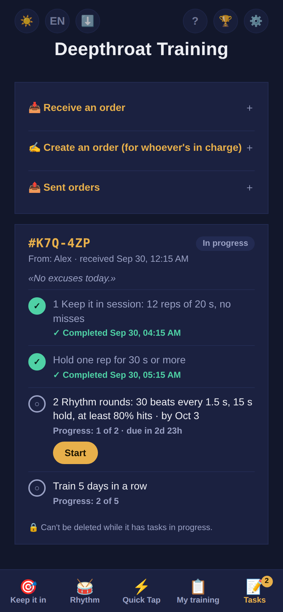

  

<h1 align="center">DT-training</h1>

  A free, private training app for adults who practice deepthroat. 
  No accounts, no tracking, no app store. Works offline.

  <a href="https://santi-kinky-apps.github.io/DT-training/"><b>▶ Open the app</b></a> ·
  <a href="README.es.md">Leer en español</a>

> **18+ only.** This project is meant exclusively for consenting adults.

---

## What it is

DT-training is a training timer you use hands-free: you rest your phone on the toy and tap the big button with your nose. It guides you through a 4-level, 28-day program, tracks your progress and streak, and lets a partner send you tasks.

  
  
  
  

## Features

- **Three tests per day**
  - **Keep it in:** hold the button for the target time.
  - **Rhythm:** tap on every beat and hold when the alarm sounds.
  - **Quick Tap:** tap as fast as you can until time runs out.
- **4 levels × 7 days** that unlock in order. Then comes **Hardcore** with its own progress, and **Master mode** after that.
- **Modifiers:** Perfect training (one miss resets the count), Continuous training (time limit between reps), Safe mode (caps any hold at 20 s), Real pace (one day per calendar day).
- **Seconds editor** to make every level easier or harder.
- **Tasks:** someone creates an order, you paste the code, and the app ticks tasks off on its own as you train. Each order has a unique ID, so a screenshot works as proof.
  - Daily tasks, surprise tasks and a deadline countdown.
  - An automatic punishment if something expires.
  - Optionally, the order can lock your settings until it ends.
- **Achievements**, a training calendar and a streak counter.
- **Backup code** to move your progress to another phone or browser.
- English and Spanish, light and dark themes, three color palettes.

## Install it on your phone

Open the link in your phone's real browser. If you got it inside Telegram, WhatsApp or Instagram, tap ⋯ → *Open in browser* first.

**iPhone (Safari)**
1. Tap **Share** (the square with an arrow).
2. Tap **Add to Home Screen**, then **Add**.

**Android (Chrome)**
1. Tap the **⋮** menu.
2. Tap **Install app** or **Add to Home screen**.

It opens full screen like a regular app, shows up as **Rutina** with a neutral icon, and works offline after the first visit.

## Privacy

- The app **does not collect, send or store any data on a server**. There is no server.
- Everything (progress, settings, tasks) is saved **only on your device**, in your browser's storage.
- No accounts, analytics, ads or cookies.
- Codes (backups, tasks) are just text you copy and paste yourself.

Because everything is local, uninstalling the app or clearing your browser data deletes your progress. Make a backup code first: ⚙️ → *Backup*.

## Disclaimer

This app is only a counting and timing tool. It is not related to any medical or health organization. Levels, times and rep counts are game values, not medical or physiological advice. Listen to your body and stop if anything hurts. Use is the sole responsibility of the user; the author is not liable for injuries, damage or any consequence of its use.

## Feedback

Found a bug or have an idea? [Open an issue](../../issues/new/choose). Please include your phone model and browser for bugs.

## Support

If the app is useful to you, you can [buy me a coffee ☕](https://buymeacoffee.com/santikinkyapps).

## License

Made by Santiago. Licensed under [CC BY-NC 4.0](LICENSE): you may share and adapt it with credit, **but not for commercial purposes**.
